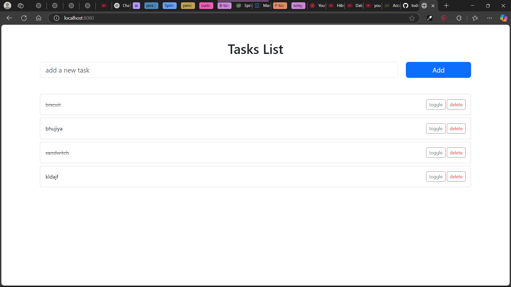

# Daily-Do Todo App

A simple and clean todo application built with Spring Boot, Thymeleaf, and MySQL. Manage your daily tasks with ease - add, toggle completion status, and delete tasks through a responsive web interface.



## Features

- ✅ **Add Tasks** - Create new todo items with a simple form
- 🔄 **Toggle Status** - Mark tasks as complete/incomplete with visual strikethrough
- 🗑️ **Delete Tasks** - Remove tasks you no longer need
- 📱 **Responsive UI** - Bootstrap-powered interface that works on all devices
- 💾 **Persistent Storage** - MySQL database keeps your tasks safe

## Tech Stack

- **Backend**: Spring Boot 3.4.2, Java 21
- **Frontend**: Thymeleaf, Bootstrap 5.3.3
- **Database**: MySQL 8
- **Build Tool**: Maven
- **Dependencies**: Spring Web, Spring Data JPA, Lombok

## Project Structure

```
src/
├── main/
│   ├── java/com/geto/todo/todo_app/
│   │   ├── TodoAppApplication.java      # Main Spring Boot application
│   │   ├── controller/
│   │   │   └── TodoController.java      # Web controller with CRUD endpoints
│   │   ├── model/
│   │   │   └── Tasks.java              # JPA entity for tasks
│   │   ├── repository/
│   │   │   └── TodoRepo.java           # JPA repository interface
│   │   └── service/
│   │       └── TodoService.java        # Business logic layer
│   └── resources/
│       ├── templates/
│       │   └── tasks_home.html         # Thymeleaf template
│       └── application.properties      # App configuration
└── test/
    └── java/com/geto/todo/todo_app/
        └── TodoAppApplicationTests.java # Basic context test
```

## Prerequisites

- Java 21 or higher
- MySQL 8.0 or higher
- Maven 3.6+ (or use included wrapper)

## Setup Instructions

### 1. Database Setup

Create a MySQL database and user:

```sql
CREATE DATABASE todo_app;
CREATE USER 'root'@'localhost' IDENTIFIED BY 'your_password';
GRANT ALL PRIVILEGES ON todo_app.* TO 'root'@'localhost';
FLUSH PRIVILEGES;
```

### 2. Configuration

Update `src/main/resources/application.properties` with your database credentials:

```properties
spring.datasource.url=jdbc:mysql://localhost:3306/todo_app
spring.datasource.username=root
spring.datasource.password=your_password
```

### 3. Run the Application

Using Maven wrapper (recommended):
```bash
./mvnw spring-boot:run
```

Or with installed Maven:
```bash
mvn spring-boot:run
```

### 4. Access the Application

Open your browser and navigate to: `http://localhost:8080`

## API Endpoints

| Method | Endpoint | Description |
|--------|----------|-------------|
| GET | `/` | Display all tasks (home page) |
| POST | `/` | Create a new task |
| GET | `/{id}/toggle` | Toggle task completion status |
| GET | `/{id}/delete` | Delete a task |

## Usage

1. **Add a Task**: Type your task in the input field and click "Add"
2. **Mark Complete**: Click the "toggle" button to mark a task as done (adds strikethrough)
3. **Delete Task**: Click the "delete" button to remove a task permanently

## Development Notes

- **Auto-reload**: Thymeleaf cache is disabled in development for hot reloading
- **Database**: Uses `hibernate.ddl-auto=update` for automatic schema updates
- **SQL Logging**: JPA queries are logged to console for debugging

## Future Enhancements

- [ ] User authentication and authorization
- [ ] Task categories and tags
- [ ] Due dates and reminders
- [ ] Task priority levels
- [ ] Search and filter functionality
- [ ] REST API for mobile apps

## Contributing

1. Fork the repository
2. Create a feature branch (`git checkout -b feature/amazing-feature`)
3. Commit your changes (`git commit -m 'Add some amazing feature'`)
4. Push to the branch (`git push origin feature/amazing-feature`)
5. Open a Pull Request

## License

This project is open source and available under the [MIT License](LICENSE).

---

