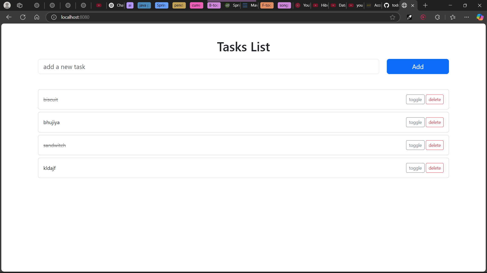

✅ Daily-Do-App — Spring Boot + Thymeleaf + MySQL
A simple and clean Task Management Web App built using
Spring Boot, Thymeleaf, and MySQL — for managing your daily tasks like a productivity ninja! 🥷📋

🧰 Tech Stack
Layer	Tech
Frontend	Thymeleaf (HTML/CSS)
Backend	Spring Boot (REST + MVC)
Database	MySQL
ORM	Spring Data JPA
✨ Features
📝 Create new tasks

📋 List all tasks on homepage

✅ Mark tasks as completed

🗑️ Delete tasks

🛠️ Edit/update task name or status

🎨 Thymeleaf templating for views

💾 Persistent storage with MySQL

📸 Screenshots
Screenshots are stored in the screenshots/ folder.
Include them in README like this:

md
Copy
Edit

🧪 How to Run Locally
1️⃣ MySQL Setup
Create a database named (for example): Daily-Do_db

Update the following in your application.properties:

properties
Copy
Edit
spring.datasource.url=jdbc:mysql://localhost:3306/Daily-Do_db
spring.datasource.username=YOUR_USERNAME
spring.datasource.password=YOUR_PASSWORD
spring.jpa.hibernate.ddl-auto=update
2️⃣ Run the App
bash
Copy
Edit
./mvnw spring-boot:run
Or just click ▶️ in your IDE.

Visit: http://localhost:8080

📁 Project Structure
css
Copy
Edit
Daily-Do-app/
├── src/
│   ├── main/
│   │   ├── java/
│   │   └── resources/
│   │       ├── templates/   <-- Thymeleaf HTML files
│   │       └── application.properties
├── screenshots/
├── pom.xml
└── README.md
